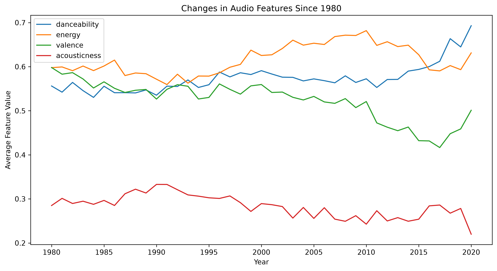
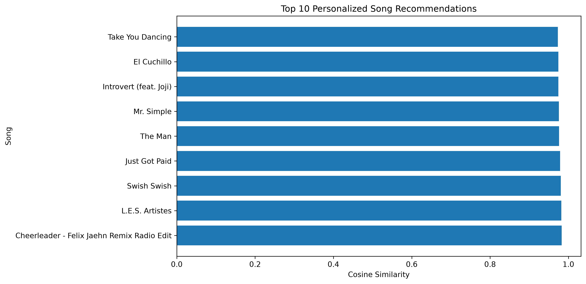

# Spotify-Music-Rec
# Music Recommendation System

## Overview

A content-based music recommendation system that recommends
songs based on Spotify audio characteristics.

## Dataset

Spotify dataset containing songs from 1980 onward.

## Features

- Danceability
- Energy
- Valence
- Acousticness
- Instrumentalness
- Liveness
- Speechiness
- Tempo
- Loudness

## Methodology

1. Filter songs to 1980+
2. Clean duplicate and missing observations
3. Standardize audio features
4. Construct user taste profiles
5. Calculate cosine similarity
6. Rank candidate songs

## Exploratory Data Analysis

## Recommendation Results

## Technologies

Python
Pandas
NumPy
Scikit-learn
Matplotlib
Seaborn
Jupyter